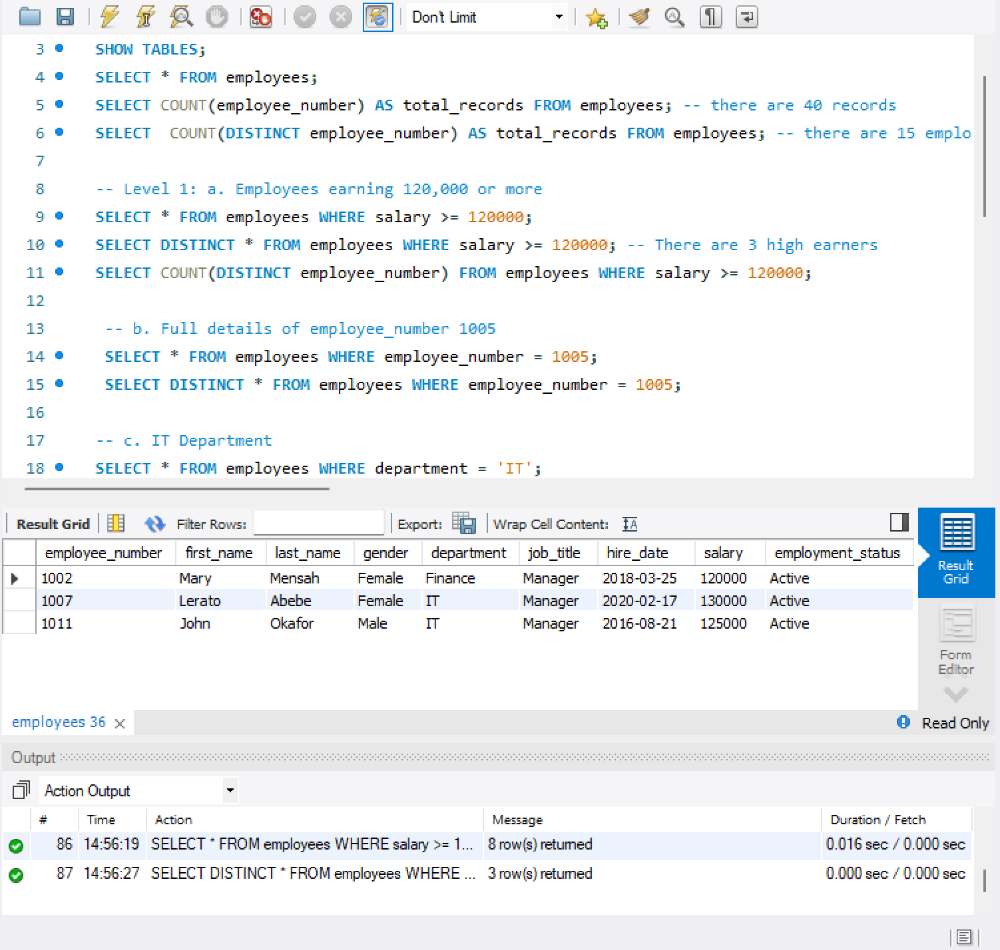

# SQL-Study-Group-Hands-On-1
## Project Overview

This project is a hands-on SQL analysis of an employee database, designed to simulate real-world business questions an analyst might encounter.

The goal is to extract insights using filtering, logical conditions, and pattern matching while building strong query-writing skills.

## Objectives

1. To answer key business questions about employees using SQL, including:

2. Identifying high earners

3. Filtering employees by department and demographics

4. Applying logical conditions for decision-making

5. Using pattern matching for deeper exploration

6. Combining multiple conditions to simulate real analyst queries

## Dataset Description

The dataset contains employee-level records with the following key fields:

employee_number – Unique identifier for each employee

first_name – Employee's first name

gender – Gender of employee

department – Department assigned

job_title – Job role

salary – Annual salary

hire_date – Date of employment

employment_status – Current status (Active, Resigned, etc.)

## Data Summary

Total records: 40

Unique employees: 15

## Tools Used

SQL: MySQL

Query editor: MySQL Workbench 

## Analysis Breakdown
### Level 1: Basic Filtering
1a. Employees earning 120,000 or more 
```sql
SELECT * FROM employees WHERE salary >= 120000;
SELECT DISTINCT * FROM employees WHERE salary >= 120000; -- There are 3 high earners
SELECT COUNT(DISTINCT employee_number) FROM employees WHERE salary >= 120000;
```

1b. Full details of employee_number 1005
```sql
SELECT * FROM employees WHERE employee_number = 1005;
SELECT DISTINCT * FROM employees WHERE employee_number = 1005;
```

1c. IT Department
```sql
SELECT * FROM employees WHERE department = 'IT';
SELECT DISTINCT * FROM employees WHERE department = 'IT';
```

### Level 2: Smart Logic

2a. Female employees in the finance department
```sql
SELECT * FROM employees WHERE gender = 'Female' AND department = 'Finance';
SELECT DISTINCT * FROM employees WHERE gender = 'Female' AND department = 'Finance'; 
```

2b. Employees whose salaries fall between 70,000 and 90,000
```sql
SELECT * FROM employees WHERE salary BETWEEN 70000 AND 90000;
SELECT DISTINCT * FROM employees WHERE salary BETWEEN 70000 AND 90000;
```

2c. Employees who are not currently Active
```sql
SELECT * FROM employees WHERE employment_status <> 'Active';
SELECT DISTINCT * FROM employees WHERE employment_status <> 'Active';
SELECT * FROM employees WHERE employment_status IN ('Resigned', 'Online');
```

### Level 3: Pattern Matching
3a. Employees with the word “Manager” anywhere in their job title
```sql
SELECT * FROM employees WHERE job_title LIKE '%Manager';
SELECT DISTINCT * FROM employees WHERE job_title LIKE '%Manager';
```

3b. Employees in Sales, Marketing, or Operations
```sql
SELECT * FROM employees WHERE department IN ('Sales', 'Marketing', 'Operations');
SELECT DISTINCT * FROM employees WHERE department IN ('Sales', 'Marketing', 'Operations');
```

c. Employees whose first_name starts with “A”
```sql
SELECT * FROM employees WHERE first_name LIKE 'A%';
SELECT DISTINCT * FROM employees WHERE first_name LIKE 'A%';
```

4. Find all Male employees who: work in Sales OR IT, were hired after 2015-01-01, and earn more than 80,000
```sql
SELECT DISTINCT * FROM employees WHERE gender = 'Male' AND hire_date > 2015-01-01 AND salary > 80000 AND department IN ('Sales', 'IT');
```

